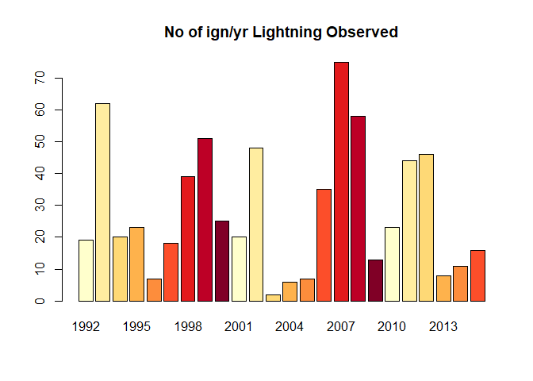
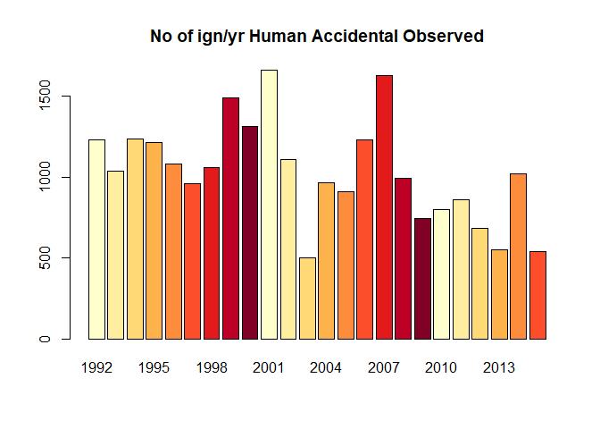
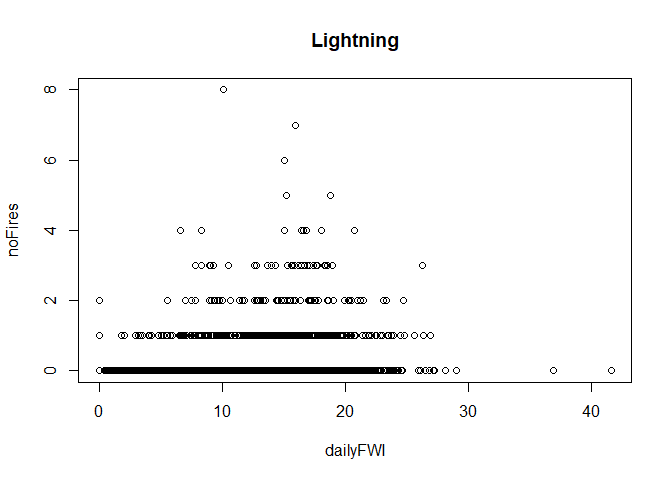
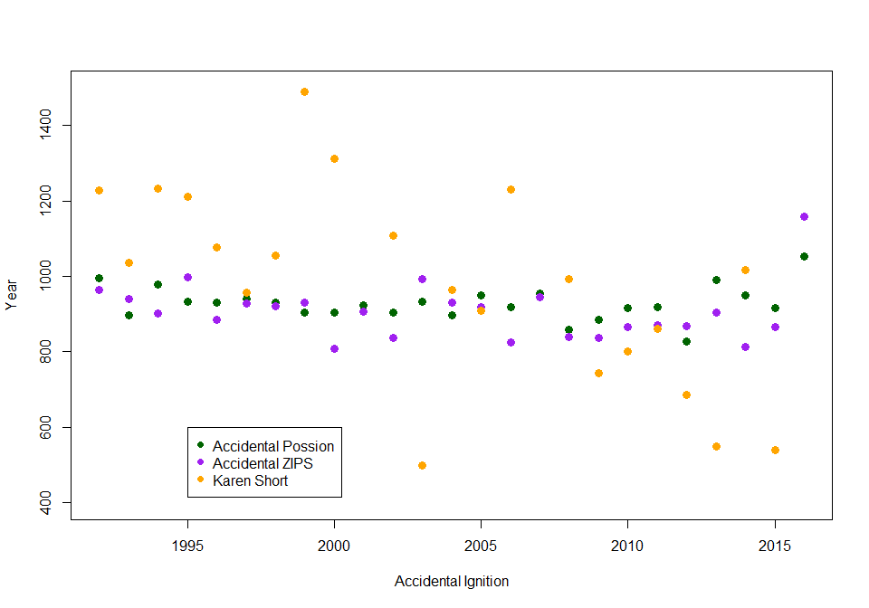
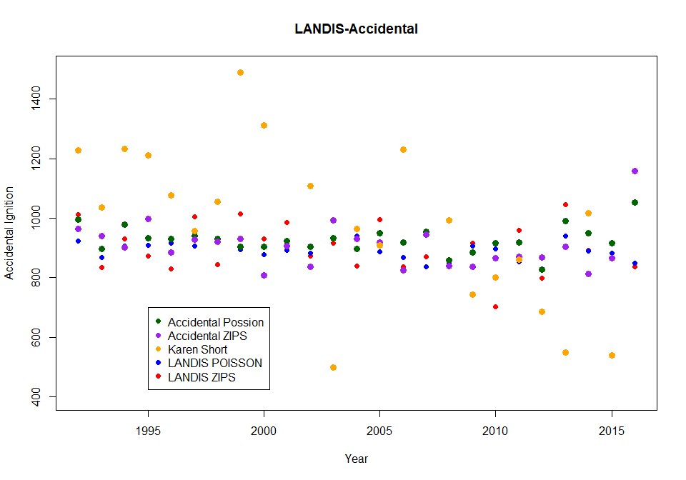
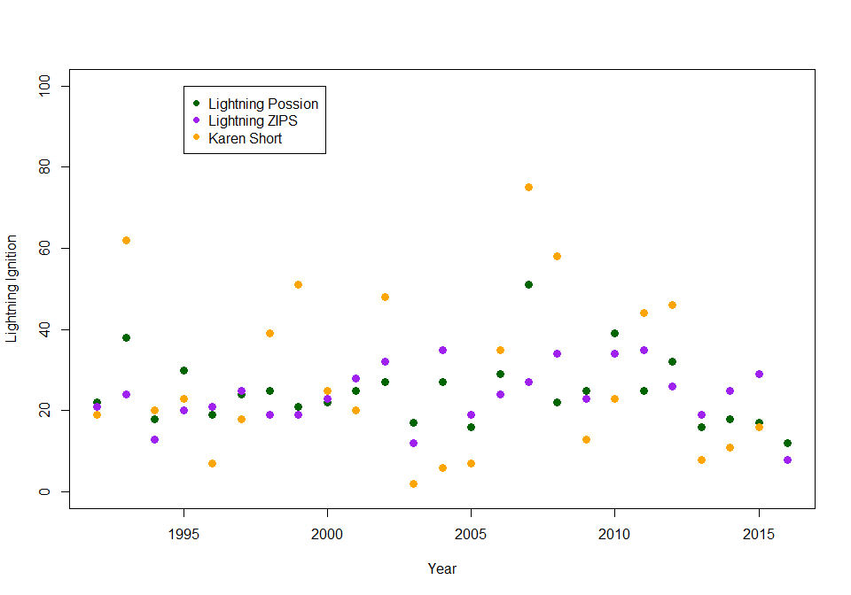
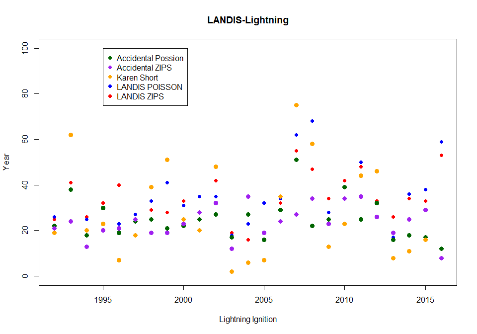

Ignitions\_FWI\_11\_2020
================
Zjrobbin
11/19/2020

``` r
library(RColorBrewer)
library(pscl)
```

    ## Warning: package 'pscl' was built under R version 4.0.3

    ## Classes and Methods for R developed in the
    ## Political Science Computational Laboratory
    ## Department of Political Science
    ## Stanford University
    ## Simon Jackman
    ## hurdle and zeroinfl functions by Achim Zeileis

``` r
library(plyr)
```

#### FWI\~ Ignition relationship

The fire weather index and igntion relationship was updated in Nov 2020
I created to script to better explain the new choices available within
the code, code is still based on AK 2017 work -ZR

Here is an example of the input file
<https://github.com/LANDIS-II-Foundation/Extension-SCRPPLE/blob/master/Testing/Core7-SCRAPPLE2.6/scrapple.txt>

The user currently has two choices in shape in fititng the data the
ignition algorithim.

  - Poisson
  - ZeroInflated Poisson

This choice is entered on line 29 If ZeroInflatedPoisson is chosen an
additional four parameters are needed.

  - LightningIgnitionsBinomialB0
  - LightningIgnitionsBinomialB1  
  - AccidentalIgnitionsBinomialB0
  - AccidentalIgnitionsBinomialB1

## Example

For this example we will be using data from Karen Shorts Fire Database
from a dataset used for the Southern Applachain Landsacpe

\*\* Short, Karen C. 2017. Spatial wildfire occurrence data for the
United States, 1992-2015 \[FPA\_FOD\_20170508\]. 4th Edition. Fort
Collins, CO: Forest Service Research Data Archive.
<https://doi.org/10.2737/RDS-2013-0009.4>
<https://www.fs.usda.gov/rds/archive/Product/RDS-2013-0009.4/> \*\*

Abstract:This data publication contains a spatial database of wildfires
that occurred in the United States from 1992 to 2015. It is the third
update of a publication originally generated to support the national
Fire Program Analysis (FPA) system. The wildfire records were acquired
from the reporting systems of federal, state, and local fire
organizations. The following core data elements were required for
records to be included in this data publication: discovery date, final
fire size, and a point location at least as precise as Public Land
Survey System (PLSS) section (1-square mile grid). The data were
transformed to conform, when possible, to the data standards of the
National Wildfire Coordinating Group (NWCG). Basic error-checking was
performed and redundant records were identified and removed, to the
degree possible. The resulting product, referred to as the Fire Program
Analysis fire-occurrence database (FPA FOD), includes 1.88 million
geo-referenced wildfire records, representing a total of 140 million
acres burned during the 24-year period.

[metadata](https://www.fs.usda.gov/rds/archive/products/RDS-2013-0009.4/_metadata_RDS-2013-0009.4.html)

These data were spatially located then divided into lightning ignitions
and accidental-human ignited values.

Here we can see the number of lightning ignited fires per year

``` r
red<-RColorBrewer::brewer.pal(9,'YlOrRd')
#plot no of fires/yr
l_fire_days_sort_count<- cbind(l_fire_days_sort, rep(1, nrow(l_fire_days_sort)))
l_fires_count <- cbind.data.frame(unique(l_fire_days_sort_count$YEAR) , 
                                 tapply(l_fire_days_sort_count$`rep(1, nrow(l_fire_days_sort))`,l_fire_days_sort_count$YEAR, sum))
colnames(l_fires_count) <- c("YEAR", "COUNT")

barplot(l_fires_count$COUNT, main ="No of ign/yr Lightning Observed",col=red,names.arg=l_fires_count$YEAR)
```

<!-- -->

and the human Ignited

``` r
h_fire_dat <- read.csv("FiresInAppsHuman2.csv")
#head(h.fire.dat)
h_fire_days <- as.data.frame(cbind(h_fire_dat$FIRE_YEAR, h_fire_dat$DISCOVER_1)) #Extracting year and julian day
colnames(h_fire_days) <- c("YEAR", "J_DAY")
h_fire_days_sort <- h_fire_days[order(h_fire_days[,1]),] #sorting by year
#plot no of fires/yr
h_fire_days_sort_count<- cbind(h_fire_days_sort, rep(1, nrow(h_fire_days_sort)))
h_fires_count <- cbind.data.frame(unique(h_fire_days_sort_count$YEAR) , 
                                  tapply(h_fire_days_sort_count$`rep(1, nrow(h_fire_days_sort))`,h_fire_days_sort_count$YEAR, sum))
colnames(h_fires_count) <- c("YEAR", "COUNT")
barplot(h_fires_count$COUNT, main ="No of ign/yr Human Accidental Observed",col=red,names.arg=h_fires_count$YEAR)
```

<!-- -->

Here we Mmtch them up with Fire weather index(FWI) data generated from
the historic record of weather fed through LANDIS-II Fire weather to get
the models calculation of FWI. See the Climate library documentation for
assistance getting FWI.

``` r
ign_types <- c("Lightning", "HumanAccidental")

fire_days_list <- list(l_fire_days_sort, h_fire_days_sort) ##organizing all ignition types into a list


##Import daily historic FWI data
FWI_dat <- read.csv("Climate-future-input-log.csv")

FWI_dat<-with(FWI_dat,aggregate(FWI,by=list(Year=Year,Timestep=Timestep),FUN=mean))


FWI_dat <- FWI_dat[,c(1,2,3)]
colnames(FWI_dat)[3]<-"FWI"
FWI_dat$ID <- paste(FWI_dat$Year, "_", FWI_dat$Timestep, sep="") #creating date identifier out of date and julian day
igns_list <- list()

for (i in 1:length(ign_types[1:2])){#THIS DOESN'T INCLUDE RX BURNS BUT THATS CAUSE WE ARE PROVIDING THOSE TO SCRAPPLE DIRECT
  ign_type_select <- fire_days_list[[i]] ##selecting each ignition type individually
  fire_days_count <- ddply(ign_type_select, .(ign_type_select$YEAR, ign_type_select$J_DAY), nrow) #finds duplicate rows in fire data
  colnames(fire_days_count) <- c("YEAR", "JD", "No_FIRES") #Renaming columns for consistency
  fire_days_count$ID <- paste(fire_days_count$YEAR, "_", fire_days_count$JD, sep="") #creating date identifier out of date and julian day

  ##Merging dataframes by year and julian day
  fire_days_short <- subset(fire_days_count, fire_days_count$YEAR < 2014) ##restricting fire records to climate file years
  FWI_short <- subset(FWI_dat, FWI_dat$Year > 1991) #restricting climate data to fire history records
  merge_col <- FWI_short$ID
  FWI_fire_merge <- join(FWI_short, fire_days_short, type="left") ##Merging based on unique date id
  FWI_fire_number <- FWI_fire_merge[,c(1,3,7)] #pulling out FWI and number of fires
  FWI_fire_number[is.na(FWI_fire_number)] <- 0 #converting NAs to 0, meaning 0 fires
  plot(FWI_fire_number[,2], FWI_fire_number[,3], main =ign_types[i], xlab = "dailyFWI", ylab = "noFires") #plotting FWI against no of fires just to look at pattern
  igns_list[[i]] <- FWI_fire_number 
}
```

    ## Joining by: ID
    ## Joining by: ID

<!-- --><!-- -->

``` r
#Lighting
print("Lighting")
```

    ## [1] "Lighting"

``` r
summary(igns_list[[1]])
```

    ##       Year           FWI            No_FIRES      
    ##  Min.   :1992   Min.   : 0.000   Min.   :0.00000  
    ##  1st Qu.:1998   1st Qu.: 3.105   1st Qu.:0.00000  
    ##  Median :2004   Median :10.750   Median :0.00000  
    ##  Mean   :2004   Mean   : 9.305   Mean   :0.07112  
    ##  3rd Qu.:2010   3rd Qu.:14.533   3rd Qu.:0.00000  
    ##  Max.   :2016   Max.   :41.593   Max.   :8.00000

``` r
#Humnan
print("Human")
```

    ## [1] "Human"

``` r
summary(igns_list[[2]])
```

    ##       Year           FWI            No_FIRES     
    ##  Min.   :1992   Min.   : 0.000   Min.   : 0.000  
    ##  1st Qu.:1998   1st Qu.: 3.105   1st Qu.: 0.000  
    ##  Median :2004   Median :10.750   Median : 0.000  
    ##  Mean   :2004   Mean   : 9.305   Mean   : 2.545  
    ##  3rd Qu.:2010   3rd Qu.:14.533   3rd Qu.: 2.000  
    ##  Max.   :2016   Max.   :41.593   Max.   :74.000

Now we individual fit the two models: One for the Lightning and one for
the Human Accidetnal.

This is where we can decide whether our model will be Poisson or Zero
Inflated Poisson:

You can read more about Poisson and Zero Inflate Poisson here.
<https://math.usu.edu/jrstevens/biostat/projects2013/rep_ZIP.pdf>

In the simpliest terms we are interested in whether the number of zeros
causes the fixed varaince in the poisson model to make the model
overdispersed. <https://en.wikipedia.org/wiki/Overdispersion>
<https://stats.stackexchange.com/questions/66586/is-there-a-test-to-determine-whether-glm-overdispersion-is-significant>

Here is both models fit to a Poisson

``` r
Lightning<-as.data.frame(igns_list[[1]])
POIS_mod_L <- glm(No_FIRES~FWI,data=Lightning, family="poisson")
summary(POIS_mod_L)
```

    ## 
    ## Call:
    ## glm(formula = No_FIRES ~ FWI, family = "poisson", data = Lightning)
    ## 
    ## Deviance Residuals: 
    ##     Min       1Q   Median       3Q      Max  
    ## -2.8054  -0.4359  -0.3245  -0.1674   7.9812  
    ## 
    ## Coefficients:
    ##              Estimate Std. Error z value Pr(>|z|)    
    ## (Intercept) -4.268433   0.104651  -40.79   <2e-16 ***
    ## FWI          0.135562   0.006719   20.18   <2e-16 ***
    ## ---
    ## Signif. codes:  0 '***' 0.001 '**' 0.01 '*' 0.05 '.' 0.1 ' ' 1
    ## 
    ## (Dispersion parameter for poisson family taken to be 1)
    ## 
    ##     Null deviance: 4021.3  on 9124  degrees of freedom
    ## Residual deviance: 3590.1  on 9123  degrees of freedom
    ## AIC: 4626.6
    ## 
    ## Number of Fisher Scoring iterations: 6

``` r
Accidental<-as.data.frame(igns_list[[2]])
POIS_mod_A <- glm(No_FIRES~FWI,data=Accidental, family="poisson")
summary(POIS_mod_A)
```

    ## 
    ## Call:
    ## glm(formula = No_FIRES ~ FWI, family = "poisson", data = Accidental)
    ## 
    ## Deviance Residuals: 
    ##     Min       1Q   Median       3Q      Max  
    ## -2.5357  -2.2003  -2.0163  -0.1212  18.6261  
    ## 
    ## Coefficients:
    ##              Estimate Std. Error z value Pr(>|z|)    
    ## (Intercept)  1.167798   0.010503  111.18   <2e-16 ***
    ## FWI         -0.026771   0.001005  -26.64   <2e-16 ***
    ## ---
    ## Signif. codes:  0 '***' 0.001 '**' 0.01 '*' 0.05 '.' 0.1 ' ' 1
    ## 
    ## (Dispersion parameter for poisson family taken to be 1)
    ## 
    ##     Null deviance: 62891  on 9124  degrees of freedom
    ## Residual deviance: 62179  on 9123  degrees of freedom
    ## AIC: 74788
    ## 
    ## Number of Fisher Scoring iterations: 6

Both of these parameters have two parameters so if you chose this model
your parameter file would read

(lines 24-29)

> LightningIgnitionsB0 -4.268433  
> LightningIgnitionsB1 0.135562  
> AccidentalIgnitionsB0 1.167798  
> AccidentalIgnitionsB1 -0.026771

> IgnitionDistribution Poisson \<\< Poisson or ZeroInflatedPoisson

and you would include nothing in the example until line 37 (Maximum Fine
Fuels)

If you were unhappy with the fit of that model you can try a Zero
Inflated Poisson

### Zero Inflated Poisson

``` r
Lightning<-as.data.frame(igns_list[[1]])

###Lightning
zeroinf_mod_L <- zeroinfl(No_FIRES~FWI,data=Lightning, dist="poisson")
summary(zeroinf_mod_L)
```

    ## 
    ## Call:
    ## zeroinfl(formula = No_FIRES ~ FWI, data = Lightning, dist = "poisson")
    ## 
    ## Pearson residuals:
    ##      Min       1Q   Median       3Q      Max 
    ## -0.93051 -0.25133 -0.18220 -0.08572 27.06358 
    ## 
    ## Count model coefficients (poisson with log link):
    ##             Estimate Std. Error z value Pr(>|z|)   
    ## (Intercept) -0.63779    0.23558  -2.707  0.00678 **
    ## FWI          0.01623    0.01523   1.066  0.28648   
    ## 
    ## Zero-inflation model coefficients (binomial with logit link):
    ##             Estimate Std. Error z value Pr(>|z|)    
    ## (Intercept)  3.83717    0.24847  15.443   <2e-16 ***
    ## FWI         -0.14822    0.01705  -8.692   <2e-16 ***
    ## ---
    ## Signif. codes:  0 '***' 0.001 '**' 0.01 '*' 0.05 '.' 0.1 ' ' 1 
    ## 
    ## Number of iterations in BFGS optimization: 10 
    ## Log-likelihood: -2097 on 4 Df

``` r
#Tst<-predict(zeroinf_mod,type="zero")
```

``` r
Accidental<-as.data.frame(igns_list[[2]])
#Lightning$No_FIRES
###Lightning
zeroinf_mod_A<- zeroinfl(No_FIRES~FWI,data=Accidental, dist="poisson")
summary(zeroinf_mod_A)
```

    ## 
    ## Call:
    ## zeroinfl(formula = No_FIRES ~ FWI, data = Accidental, dist = "poisson")
    ## 
    ## Pearson residuals:
    ##      Min       1Q   Median       3Q      Max 
    ## -0.83517 -0.77786 -0.74329 -0.05562 21.05612 
    ## 
    ## Count model coefficients (poisson with log link):
    ##              Estimate Std. Error z value Pr(>|z|)    
    ## (Intercept)  1.920144   0.010591  181.30   <2e-16 ***
    ## FWI         -0.021641   0.001023  -21.16   <2e-16 ***
    ## 
    ## Zero-inflation model coefficients (binomial with logit link):
    ##             Estimate Std. Error z value Pr(>|z|)   
    ## (Intercept) 0.115584   0.036608   3.157  0.00159 **
    ## FWI         0.009369   0.003238   2.893  0.00381 **
    ## ---
    ## Signif. codes:  0 '***' 0.001 '**' 0.01 '*' 0.05 '.' 0.1 ' ' 1 
    ## 
    ## Number of iterations in BFGS optimization: 6 
    ## Log-likelihood: -2.51e+04 on 4 Df

These models each have four parameters so your input would look as
follows  
From line (24-35)

> LightningIgnitionsB0 -0.63779  
> LightningIgnitionsB1 0.01623  
> AccidentalIgnitionsB0 1.920144  
> AccidentalIgnitionsB1 -0.021641

> IgnitionDistribution ZeroInflatedPoisson \<\< Poisson or
> ZeroInflatedPoisson

> LightningIgnitionsBinomialB0 3.83717  
> LightningIgnitionsBinomialB1 -0.14822  
> AccidentalIgnitionsBinomialB0 0.115584  
> AccidentalIgnitionsBinomialB1 0.009369

How these models impact your ignition model will be data dependent.

### Testing

Here we can test how those formulas will play out within the model

``` r
FWI_dat<- read.csv("Climate-future-input-log.csv")
FWI_dat<-with(FWI_dat,aggregate(FWI,by=list(Year=Year,Timestep=Timestep),FUN=mean))

FWI_dat<-FWI_dat[FWI_dat$Year %in% seq(1992,2016),]
FWI_Test<-FWI_dat$x
Pb0<-(1.167798)
Pb1<-(-.026771)
###Possion model 
Acc_Ign_Test_Pois<-rpois(9125, lambda = exp((Pb0+(Pb1*FWI_Test))))

##ZIPS model 


binomb0=.115584
binomb1=.009369

b0=(1.920144)
b1=(-.021641)

alpha<-exp(binomb0+binomb1*FWI_Test)
zeroprob= alpha/(alpha+1)
Acc_Ign_Test<-ifelse((zeroprob<=runif(length(zeroprob),0,1)),
        round(rpois(9125, lambda = exp((b0+(b1*FWI_Test))))),
       0)

### Aggregate to the year 
Acc_Ign_df<-cbind(FWI_dat[,c(1,2)],Acc_Ign_Test)
Acc_Years<-aggregate(list(Ignitions=Acc_Ign_df$Acc_Ign_Test),by=list(Year=Acc_Ign_df$Year),FUN=sum)

PAcc_Ign_df<-cbind(FWI_dat[,c(1,2)],Acc_Ign_Test_Pois)
PAcc_Years<-aggregate(list(Ignitions=PAcc_Ign_df$Acc_Ign_Test_Pois),by=list(Year=PAcc_Ign_df$Year),FUN=sum)

plot(PAcc_Years$Year,PAcc_Years$Ignitions,col="darkgreen",ylim=c(400,1500),pch=16,cex=1.3,xlab="Accidental Ignition",ylab="Year")
points(Acc_Years$Year,Acc_Years$Ignitions,col="purple",pch=16,cex=1.3)
points(h_fires_count$YEAR,h_fires_count$COUNT,col="orange",pch=16,cex=1.3)

legend(1995,600,legend=c("Accidental Possion","Accidental ZIPS","Karen Short"),pch=c(16,16,16),col=c("darkgreen","purple","orange"))
```

<!-- -->

We can see there is not a huge differnce but perhaps the ZIPS model has
a larger variance annually. However there is perhaps more variation in
the realworld data than is captured in the model.

Here we can compare to the results we get from the model

``` r
ZIP_Ignitions<-read.csv("scrapple-ignitions-log.csv")
Pois<-read.csv("scrapple-ignitions-logPois_2.csv")

ZIP<-aggregate(x=list(Count=ZIP_Ignitions$ActualNumberIgnitions,OtherCount=ZIP_Ignitions$AttemptedNumberIgnitions),
              by=list(Year=ZIP_Ignitions$SimulationYear,Type=ZIP_Ignitions$IgnitionType),
              FUN=sum)
P_inf<-aggregate(x=list(Count=Pois$ActualNumberIgnitions,OtherCount=Pois$AttemptedNumberIgnitions),
              by=list(Year=Pois$SimulationYear,Type=Pois$IgnitionType),
              FUN=sum)

#OIL<-OI[OI$Type==" Accidental",]

ZIPA<-ZIP[ZIP$Type==" Accidental",]
P_infA<-P_inf[P_inf$Type==" Accidental",]
#unique(Merged$IgnitionType)
plot(PAcc_Years$Year,ZIPA$Count[1:25],ylim=c(400,1500),pch=16,col="red",main="LANDIS-Accidental",ylab="Accidental Ignition",xlab="Year")
points(PAcc_Years$Year,P_infA$Count[1:25],col="blue",pch=16)
points(PAcc_Years$Year,PAcc_Years$Ignitions,col="darkgreen",pch=16,cex=1.3,xlab="Accidental Ignition",ylab="Year")
points(Acc_Years$Year,Acc_Years$Ignitions,col="purple",pch=16,cex=1.3)
points(h_fires_count$YEAR,h_fires_count$COUNT,col="orange",pch=16,cex=1.3)

legend(1995,700,legend=c("Accidental Possion","Accidental ZIPS","Karen Short","LANDIS POISSON","LANDIS ZIPS"),pch=c(16,16,16,16,16),col=c("darkgreen","purple","orange",'blue','red'))
```

<!-- -->

We see agian the ZIPs model has more variance, more akin to the the
data.

Here is the ligthning ignitoin

``` r
FWI_dat<- read.csv("Climate-future-input-log.csv")
FWI_dat<-with(FWI_dat,aggregate(FWI,by=list(Year=Year,Timestep=Timestep),FUN=mean))

FWI_dat<-FWI_dat[FWI_dat$Year %in% seq(1992,2016),]
FWI_Test<-FWI_dat$x
Pb0<-(-4.268433)
Pb1<-(.135562)
###Possion model 
Lig_Ign_Test_Pois<-rpois(9125, lambda = exp((Pb0+(Pb1*FWI_Test))))

##ZIPS model 


binomb0=3.83717
binomb1=-.14822

b0=(-.63779)
b1=(.01623)

alpha<-exp(binomb0+binomb1*FWI_Test)
zeroprob= alpha/(alpha+1)
Lig_Ign_Test<-ifelse((zeroprob<=runif(length(zeroprob),0,1)),
        round(rpois(9125, lambda = exp((b0+(b1*FWI_Test))))),
       0)

### Aggregate to the year 
Lig_Ign_df<-cbind(FWI_dat[,c(1,2)],Lig_Ign_Test)
Lig_Years<-aggregate(list(Ignitions=Lig_Ign_df$Lig_Ign_Test),by=list(Year=Lig_Ign_df$Year),FUN=sum)

PLig_Ign_df<-cbind(FWI_dat[,c(1,2)],Lig_Ign_Test_Pois)
PLig_Years<-aggregate(list(Ignitions=PLig_Ign_df$Lig_Ign_Test_Pois),by=list(Year=PLig_Ign_df$Year),FUN=sum)

plot(PLig_Years$Year,PLig_Years$Ignitions,col="darkgreen",ylim=c(0,100),pch=16,cex=1.3,ylab="Lightning Ignition",xlab="Year")
points(Lig_Years$Year,Lig_Years$Ignitions,col="purple",pch=16,cex=1.3)
points(l_fires_count$YEAR,l_fires_count$COUNT,col="orange",pch=16,cex=1.3)

legend(1995,100,legend=c("Lightning Possion","Lightning ZIPS","Karen Short"),pch=c(16,16,16),col=c("darkgreen","purple","orange"))
```

<!-- -->

and with the LANDIS Scrpple lightning outputs using the above parameters

``` r
ZIPL<-ZIP[ZIP$Type==" Lightning",]
P_infL<-P_inf[P_inf$Type==" Lightning",]

plot(PAcc_Years$Year,ZIPL$Count[1:25],ylim=c(0,100),pch=16,col="red",main="LANDIS-Lightning",xlab="Lightning Ignition",ylab="Year")
points(PAcc_Years$Year,P_infL$Count[1:25],col="blue",pch=16)
points(PLig_Years$Year,PLig_Years$Ignitions,col="darkgreen",pch=16,cex=1.3,xlab="Accidental Ignition",ylab="Year")
points(Lig_Years$Year,Lig_Years$Ignitions,col="purple",pch=16,cex=1.3)
points(l_fires_count$YEAR,l_fires_count$COUNT,col="orange",pch=16,cex=1.3)

legend(1995,100,legend=c("Accidental Possion","Accidental ZIPS","Karen Short","LANDIS POISSON","LANDIS ZIPS"),pch=c(16,16,16,16,16),col=c("darkgreen","purple","orange",'blue','red'))
```

<!-- -->
