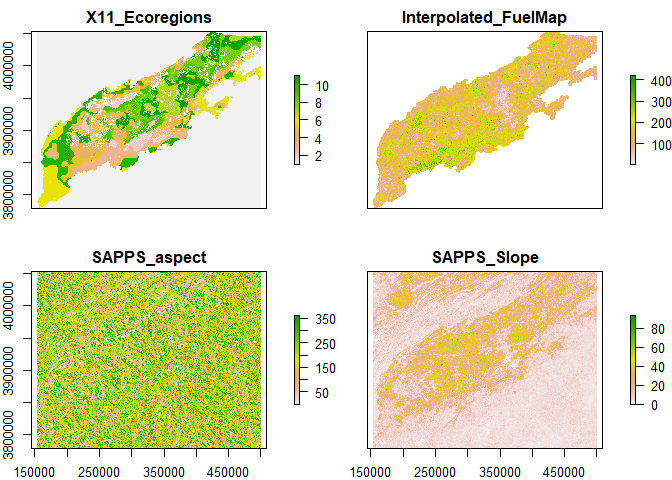
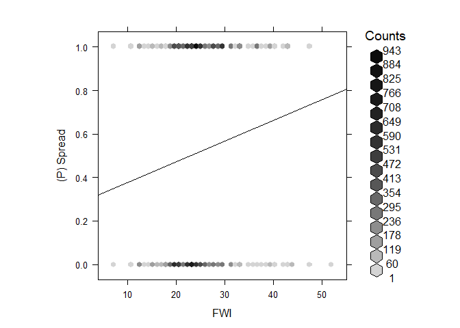
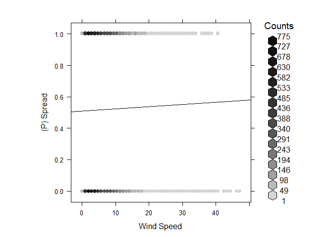
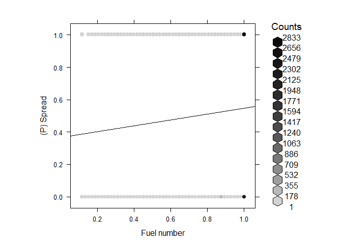
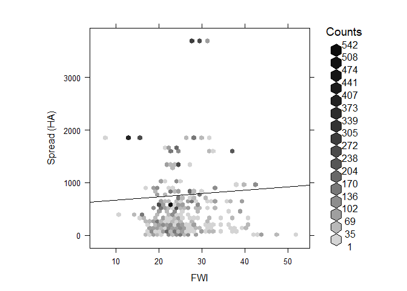
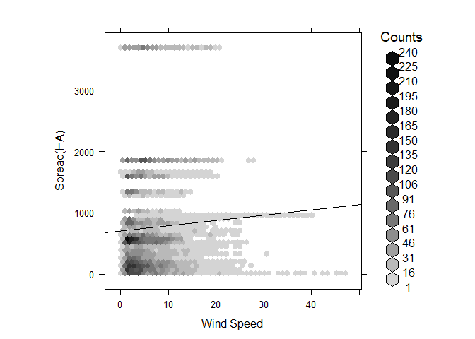
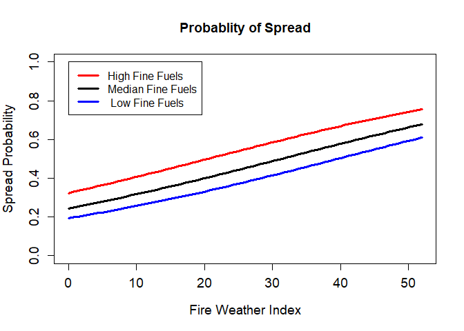
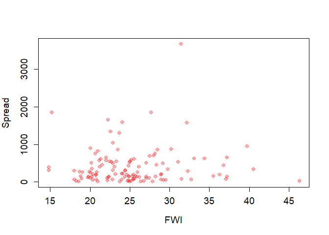
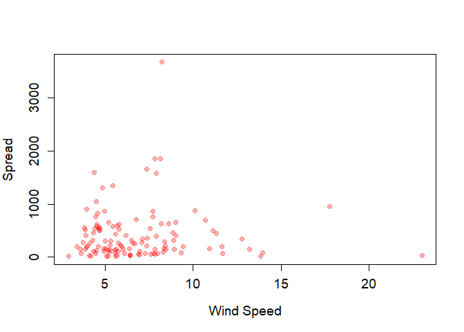
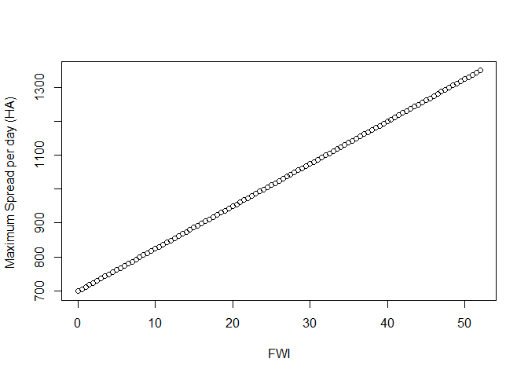

R Notebook
================

############## 

This the code provides a simple example of how to use geomac shape files
to estimate the fire spread parameters needed for scrpple. Please raise
an issue on this github page if you have corrections or questions. No
warranty on parameters. This is only to serve as an educational tool

ZJ Robbins 2021 \#\#\#\#\#\#\#\#\#\#\#\#\#\#

    ## Loading required package: sp

    ## Checking rgeos availability: TRUE

    ## 
    ## Attaching package: 'dplyr'

    ## The following objects are masked from 'package:raster':
    ## 
    ##     intersect, select, union

    ## The following objects are masked from 'package:stats':
    ## 
    ##     filter, lag

    ## The following objects are masked from 'package:base':
    ## 
    ##     intersect, setdiff, setequal, union

    ## rgdal: version: 1.5-16, (SVN revision 1050)
    ## Geospatial Data Abstraction Library extensions to R successfully loaded
    ## Loaded GDAL runtime: GDAL 3.0.4, released 2020/01/28
    ## Path to GDAL shared files: C:/Users/zacha/Documents/R/win-library/4.0/rgdal/gdal
    ## GDAL binary built with GEOS: TRUE 
    ## Loaded PROJ runtime: Rel. 6.3.1, February 10th, 2020, [PJ_VERSION: 631]
    ## Path to PROJ shared files: C:/Users/zacha/Documents/R/win-library/4.0/rgdal/proj
    ## Linking to sp version:1.4-2
    ## To mute warnings of possible GDAL/OSR exportToProj4() degradation,
    ## use options("rgdal_show_exportToProj4_warnings"="none") before loading rgdal.

    ## rgeos version: 0.5-5, (SVN revision 640)
    ##  GEOS runtime version: 3.8.0-CAPI-1.13.1 
    ##  Linking to sp version: 1.4-2 
    ##  Polygon checking: TRUE

    ## 
    ## Attaching package: 'nplr'

    ## The following object is masked from 'package:raster':
    ## 
    ##     overlay

    ## Classes and Methods for R developed in the
    ## Political Science Computational Laboratory
    ## Department of Political Science
    ## Stanford University
    ## Simon Jackman
    ## hurdle and zeroinfl functions by Achim Zeileis

    ## Loading required package: nlme

    ## 
    ## Attaching package: 'nlme'

    ## The following object is masked from 'package:dplyr':
    ## 
    ##     collapse

    ## The following object is masked from 'package:raster':
    ## 
    ##     getData

``` r
w_dir <- "Inputs/"
```

Here we are looking to fit a binomial model relating the probability to
fire weather index (FWI), wind, and fuels.

For this we have wind data and Fire weather index data located to
climate regions in LANDIS-II This is Gridmet data from the University of
Idaho <http://www.climatologylab.org/gridmet.html>
[meta](https://cida.usgs.gov/thredds/dodsC/UofIMETDATA.html)

The ecoregion map is used to locate the windspeed and the FWI data for
each time step.

``` r
## This is the Fire weather index calculation 
fwi_dat <- read.csv(paste0(w_dir,"11_Eco_Climate.csv"),stringsAsFactors = FALSE)
### This is the climate regions we are using in the Southern APPS
wind_map<- raster::raster(paste(w_dir,"11_Ecoregions.tif",sep=""))
```

    ## Warning in showSRID(uprojargs, format = "PROJ", multiline = "NO"): Discarded datum Unknown based on GRS80 ellipsoid in CRS definition,
    ##  but +towgs84= values preserved

``` r
### Wind speed map
wsv_dat <- read.csv(paste(w_dir,"Wind_1028.csv",sep=""),stringsAsFactors = FALSE)
colnames(wsv_dat) <- c("date", "eco1", 'eco2', 'eco3', 'eco4','eco5','eco6','eco8','eco9','eco10','eco11')
wdir_dat <- read.csv(paste(w_dir,"Winddir.csv",sep=""),stringsAsFactors = FALSE)
colnames(wdir_dat) <- c("date", "eco1", 'eco2', 'eco3', 'eco4','eco5','eco6','eco8','eco9','eco10','eco11')


plot(wind_map)
```

<!-- -->

We also have a fuel map representing landscape level fuels for the study
area, as well as an uphill azimuth map and a slope map (used to
calculate the direction of windspeed)

``` r
### Here is an outline raster.
ExampleRaster<-raster(paste(w_dir,"11_Ecoregions.tif",sep=""))
```

    ## Warning in showSRID(uprojargs, format = "PROJ", multiline = "NO"): Discarded datum Unknown based on GRS80 ellipsoid in CRS definition,
    ##  but +towgs84= values preserved

``` r
### This is the landis produced fuel map based on the vegetation 
fuel_map<-raster(paste0(w_dir,"Interpolated_FuelMap.tif"))
```

    ## Warning in showSRID(uprojargs, format = "PROJ", multiline = "NO"): Discarded datum Unknown based on GRS80 ellipsoid in CRS definition,
    ##  but +towgs84= values preserved

``` r
### This is the uphill azimuth map 
uphill_azi_map<- raster(paste(w_dir,"SAPPS_aspect.tif",sep=""))
```

    ## Warning in showSRID(uprojargs, format = "PROJ", multiline = "NO"): Discarded datum Unknown based on GRS80 ellipsoid in CRS definition,
    ##  but +towgs84= values preserved

``` r
### This a slope map. 
slope_map <-  raster(paste(w_dir,"SAPPS_Slope.tif",sep=""))
```

    ## Warning in showSRID(uprojargs, format = "PROJ", multiline = "NO"): Discarded datum Unknown based on GRS80 ellipsoid in CRS definition,
    ##  but +towgs84= values preserved

This all becomes one raster stack to look at in the analysis.

``` r
#wind_map <- projectRaster(wind_map, to = fuel_map, method='ngb')
##Stacking all rasters as a test
climate_stack <- stack(wind_map, fuel_map, uphill_azi_map, slope_map)
plot(climate_stack)
```

<!-- -->

### Here is the processing of the geomac/NIFC data

That data is reposited here <https://rmgsc.cr.usgs.gov/outgoing/GeoMAC/>
and here <https://www.geomac.gov/GeoMACTransition.shtml> and here
<https://data-nifc.opendata.arcgis.com/>

These are shape files for each days fire boundary, gathered together by
fire. They are used to measure cells for which spread occurs and which
it does not.

``` r
#Empty objects and column names and stuff used in loops
newfire<-readOGR(paste(w_dir,"fire_geomac_loc.shp",sep=""))
```

    ## OGR data source with driver: ESRI Shapefile 
    ## Source: "C:\Users\zacha\Documents\GitHub\Extension-SCRPPLE\Supporting R Code\Spread_Commit\Inputs\fire_geomac_loc.shp", layer: "fire_geomac_loc"
    ## with 591 features
    ## It has 64 fields
    ## Integer64 fields read as strings:  OBJECTID fireyear

``` r
## Putting into sets based on differnces in meta-data (columns not matched)
newfire1<-newfire[newfire$incidentna!=0,]
newfire2<-newfire[newfire$incidentna==0,]
newfire_df<-data.frame(newfire)
perimeter_map<-newfire
### Here we are cleaning the data
perimeter_map$TrueDate<-as.Date(perimeter_map$perimeterd)
perimeter_map$TrueDate[is.na(perimeter_map$TrueDate)]<-as.Date(perimeter_map$date_[is.na(perimeter_map$TrueDate)])
### Subseting to our time period of climate coverage (< 2017)
perimeter_map<-perimeter_map[perimeter_map$TrueDate<"2017-01-01",]
perimeter_map$incidentna[perimeter_map$incidentna=='0']<-perimeter_map$fire_name[perimeter_map$incidentna=='0']
perimeter_map$incidentna[perimeter_map$incidentna==0]<-perimeter_map$fire_name[perimeter_map$incidentna==0]

DFP<-as.data.frame(perimeter_map)

fire_names<-as.character(perimeter_map$incidentna)
## Here we plot the shapefiles to see that they overlap
###Climate regions
plot(ExampleRaster)
plot(newfire,add=TRUE)
```

<!-- -->

``` r
plot(fuel_map)
plot(newfire,add=TRUE)
```

<!-- -->

``` r
## Cleaning up the raster data to match.
fwi_dat_slim <- fwi_dat[,c(1,2,3,22)]
colnames(fwi_dat)
```

    ##  [1] "Year"                 "Timestep"             "EcoregionName"       
    ##  [4] "EcoregionIndex"       "ppt"                  "min_airtemp"         
    ##  [7] "max_airtemp"          "std_ppt"              "std_temp"            
    ## [10] "winddirection"        "windspeed"            "ndeposition"         
    ## [13] "co2"                  "relativehumidity"     "min_relativehumidity"
    ## [16] "max_relativehumidity" "specifichumidty"      "par"                 
    ## [19] "ozone"                "shortwave"            "temperature"         
    ## [22] "FWI"                  "X"

``` r
fwi_date_info <- with(fwi_dat_slim, paste(Year, Timestep))
fwi_dates <- strptime(fwi_date_info, "%Y %j") #Converting from julian day to 
fwi_date_dat <- cbind(as.POSIXct(fwi_dates), fwi_dat_slim[,3:4]) #attaching 
colnames(fwi_date_dat) <- c("Date", "Ecoregion", "FWI")
fwi_date_dat$Ecoregion<-gsub("eco","",fwi_date_dat$Ecoregion)
fwi_date_dat$Ecoregion<-as.numeric(as.character(fwi_date_dat$Ecoregion))
```

### Investigating the shape files, we selected out those that have mulitple days of spread, and logical shape progressions. We remove those whose differnce in shape is

attributable to same area drawn seperately.

``` r
## These fires were filtered by having multiple days of spread, and shapes that made sense as a progression. 
SoundInc<-c("BOTELER","Halls Top","SILVER MINE",'Chestnut Knob',"Rough Ridge","DICK'S CREEK",'CLIFFSIDE','Rattlesnake Hollow','MAPLE SPRINGS','Rock Mountain',"OLD ROUGHY",
"KNOB","Quarry Creek","DOBSON 3","CLEAR CREEK","TELLICO","TIMBER RIDGE","East Miller Cove","FEREBEE MEMORIAL","HORTON","CAMP BRANCH","DOBSON KNOB","Wolf Creek","HAPPY VALLEY RIDGE","WHITE CREEK",
"Pinnacle Mountain","PARTY ROCK")
```

Here is the algorithim that calculates the spread cells versus the non
spread cells.

``` r
years <- 1992:2017
climate_day_mat <- NULL

wsv_dat_df<-as.data.frame(wsv_dat)
##Select for fires that lasted more than 1 day
fire_names_manydays <-fire_names[!duplicated(fire_names)]
fire_names_manydays <- fire_names_manydays[!is.na(fire_names_manydays)] ##Removing potential NAs
fire_names_manydays<- fire_names_manydays[fire_names_manydays %in% SoundInc]

### For each fire for each day. 
for (i in 1:length(fire_names_manydays)){
  #print(fire_names_manydays[i])

  fire_select <- subset(perimeter_map, perimeter_map$incidentna ==fire_names_manydays[i])#selecting an individual fire
  fire_days <- as.character(sort(unique(fire_select$TrueDate)))
  ### Check that there are two days worth of data to look at. 
  if(length(fire_days) < 2) next
  storedcells<-NULL
  dftest<-as.data.frame(fire_select)
   ### This subloop looks through each set of polygons (t, t+1) and finds the last day in which expansion occurs
  ### this will indicate when to tell th algorithim to consider the remaining cells failed spread. 
  
  for(j in 1:(length(fire_days)-1)){

     ## Day t shape
    fire_day_select <- subset(fire_select, fire_select$TrueDate == fire_days[j])# selecting the first day of the fire
    fire_day_select<-fire_day_select[order(fire_day_select$acres),]
    fire_day_select <- fire_day_select[1,] #selecting the first fire perim from that date, in case there are multiples
    ## Day t+1 shape
    fire_day_select_1 <- subset(fire_select, fire_select$TrueDate== fire_days[j+1])# getting day 2 fire perimeter
    fire_day_select_1<-fire_day_select_1[order(fire_day_select_1$acres),]
    fire_day_select_1 <- fire_day_select_1[1,] #selecting the first fire perim from that date, in case there are multiples
    area_expansion <-(area(fire_day_select_1)/4046.86)-(area(fire_day_select)/4046.86)
    if(area_expansion < 30.00){
      next()
      }
    lastday<-j
 
  }
 
  for(j in 1:(length(fire_days)-1)){
 
    Failedvalues<-NA
    Successcells<-NA
    EndFailedvalues<-NA
    #print(paste0("day  ",j))
    ## day t shape
    fire_day_select <- subset(fire_select, fire_select$TrueDate == fire_days[j])# selecting the first day of the fire
    fire_day_select<-fire_day_select[order(fire_day_select$acres),]
    fire_day_select <- fire_day_select[1,] #selecting the first fire perim from that date, in case there are multiples
    ## day t+1 shape
    fire_day_select_1 <- subset(fire_select, fire_select$TrueDate== fire_days[j+1])#getting day 2 fire perimeter
    fire_day_select_1<-fire_day_select_1[order(fire_day_select_1$acres),]
    fire_day_select_1 <- fire_day_select_1[1,] #selecting the first fire perim from that date, in case there are multiples
    ## calculate area of expansion, Area m2 to acres.
    area_expansion <-(area(fire_day_select_1)/4046.86)-(area(fire_day_select)/4046.86)
    ### In this case the spread would be less than one 250m cell in our simulation.
    if(area_expansion < 30.00){
   #   print("next")
      next()
      }
    
    ### Here we associate the wind and fire weather index, and reclassify the 
    ### raster to associate with spread/not spread cells
    WindMap<-climate_stack$X11_Ecoregions
 
    wind_today<-wsv_dat_df %>%
      subset(date==gsub("/","-",paste0(fire_days[j],'T00:00:00Z')))
    WindTrans=as.matrix(data.frame(was=c(2,3,4,5,6,7,8,9,10,11),
               is=as.numeric(t(wind_today[2:11]))))
    Wind_Reclas<-reclassify(WindMap,WindTrans)
    windir_today<-wdir_dat %>%
      subset(date==gsub("/","-",paste0(fire_days[j],'T00:00:00Z')))
    WindDirRe=as.matrix(data.frame(was=c(2,3,4,5,6,7,8,9,10,11),
               is=as.numeric(t(windir_today[2:11]))))
    WindDir_Reclas<-reclassify(WindMap,WindDirRe)
    fire_today<-fwi_date_dat%>%
      subset(Date ==gsub("/","-",paste0(fire_days[j],'T00:00:00Z')))%>%
      arrange(Ecoregion)
    FireMap<-climate_stack$X11_Ecoregions
    FireTrans=as.matrix(data.frame(was=c(2,3,4,5,6,7,8,9,10,11),
               is=fire_today$FWI))
    FireWeather<-reclassify(FireMap,FireTrans)  
    End_stack<-stack(climate_stack,FireWeather,Wind_Reclas,WindDir_Reclas)
   
    #Creating vector of fire dates. It doesnt work when I bind them below for some reason 
    date_char <- as.POSIXct(as.character(fire_day_select$TrueDate)) 
    
    ##Extracting climate and fuels variables from raster stack.
    #This will compile a data frame of every cell that fire perimeters touch and whether 
    day1 <- extract(End_stack, fire_day_select, cellnumbers = TRUE, df=TRUE, method="simple")
    
    day2 <- extract(End_stack, fire_day_select_1, cellnumbers = TRUE, df=TRUE, method="simple")
    
    # First find day not in stored, then find adajecnts, remove adjecnets in stored. 
    
    day1cells<-day1$cell[!day1$cell %in% storedcells]
    storedcells<-c(storedcells,day1$cell)
    if( length(day1cells) >0){ 
    adjacentcells1<-adjacent(End_stack,day1cells,directions=4, pairs=TRUE,id=TRUE)
    adjacentcells1<-unique(adjacentcells1[,3])
    adjacentcells1<-adjacentcells1[!adjacentcells1 %in% storedcells]
    }else(adjacentcells1=NA)
    newspread<-day2$cell[!day2$cell %in% storedcells]
    ### Calculate failed spread, areas where spred could occur, but are have not previously been tried. 
    Failedvalues<-data.frame()
    if( length(day1cells) >0){ 
    FailedCells=adjacentcells1[!adjacentcells1 %in% newspread]
    Failedvalues<-as.data.frame(extract(End_stack,adjacentcells1))
    }
    if (nrow(Failedvalues)>0){ Failedvalues$spread_success<-0}
    Successcells<-as.data.frame(extract(End_stack,newspread))
    if (nrow(Successcells)==0){next}
    ### Successful spread gets one 
    Successcells$spread_success<-1
    ### Here if it is the last day of spread, calculate one more days possible spread,
    ### all of which is counted as failed. 
    EndFailedvalues<-data.frame()
    if(j==(lastday)){
    ### Creating the same wind and fire weather index as above. 
    wind_today<-wsv_dat_df %>%
      subset(date==gsub("/","-",paste0(fire_days[j],'T00:00:00Z')))
    WindTrans=as.matrix(data.frame(was=c(2,3,4,5,6,7,8,9,10,11),
               is=as.numeric(t(wind_today[2:11]))))
    Wind_Reclas<-reclassify(WindMap,WindTrans)
    windir_today<-wdir_dat %>%
      subset(date==gsub("/","-",paste0(fire_days[j],'T00:00:00Z')))
    WindDirRe=as.matrix(data.frame(was=c(2,3,4,5,6,7,8,9,10,11),
               is=as.numeric(t(windir_today[2:11]))))
    WindDir_Reclas<-reclassify(WindMap,WindDirRe)
    
    fire_today<-fwi_date_dat%>%
      subset(Date ==gsub("/","-",paste0(fire_days[j],'T00:00:00Z')))%>%
      arrange(Ecoregion)
    FireMap<-climate_stack$X11_Ecoregions
    FireTrans=as.matrix(data.frame(was=c(1,2,3,4,5,6,8,9,10,11),
               is=fire_today$FWI))
    FireWeather<-reclassify(FireMap,FireTrans)  
    End_stack<-stack(climate_stack,FireWeather,Wind_Reclas,WindDir_Reclas)
    EndCells<-adjacent(End_stack,day2$cell,directions=4, pairs=TRUE,id=TRUE)
    EndCells<-unique(EndCells[,3])
    EndCells<-EndCells[!EndCells %in% storedcells]
    EndFailedvalues<-as.data.frame(extract(End_stack,EndCells))
    EndFailedvalues$spread_success<-0
    }
    ### Adding cells to one dataframe.
    if(nrow(Failedvalues)>0 & nrow(Successcells)>0){
    Dfout<-rbind(Failedvalues,Successcells)}else{Dfout<-Successcells}
    if(nrow(EndFailedvalues)>0){Dfout<-rbind(Dfout,EndFailedvalues) }
    #print(table(Dfout$spread_success))
    Dfout$Area_expansion<-area_expansion
    climate_day_df <- cbind(fire_names_manydays[j],
                                 as.character(date_char),Dfout) #Putting everything into a big dataframe with all climate variables
    climate_day_mat <- rbind.data.frame(climate_day_mat, climate_day_df) #binding individual days to everyother day
  }
  
}
## Save for future analysis
write.csv(climate_day_mat,"Inputs/Example.csv")
```

Here is a table of thenumber of successful spread events versus not
successfull spread events

``` r
table(climate_day_mat$spread_success)
```

    ## 
    ##    0    1 
    ## 6846 7368

``` r
### Cleaning up the dataframe. 
climate_day_mat<-read.csv("Inputs/Example.csv")
climate_day_total<-climate_day_mat[-1]

### Looking at files that have all the nessecary data 
climate_day_total<-climate_day_total[!climate_day_total$X11_Ecoregions.1==1,]
#colnames(climate_day_complete)
climate_day_complete <- climate_day_total[complete.cases(climate_day_total[2:11]),]

##Attaching a unique ID to each row in case we need it later
climate_day_complete <- cbind(1:nrow(climate_day_complete), climate_day_complete)

##Renaming columns
#climate_day_complete<-climate_day_complete[,-1]
colnames(climate_day_complete) <- c("ID","FireName",  "date", "wind_region", "fuel_number", "uphill_azi", "slope",
                               "FWI","WSPD" ,"Winddir","spread","expansion")
climate_day_complete$expansion<-climate_day_complete$expansion*0.404686 ## To hectares
climate_day_complete$fuel_number<-climate_day_complete$fuel_number/2000
climate_day_complete$fuel_number[climate_day_complete$fuel_number >1.0]<-1.0


U_b <- 5 # This changes based on fire severity. Combustion bounancy.
### Caculating windspeed in direction of spread 
relative_wd <- as.numeric(climate_day_complete$Winddir) - as.numeric(climate_day_complete$uphill_azi)
### Calculating effective wind speed. 
climate_day_complete$effective_wsv <- U_b * ((fix(climate_day_complete$WSPD)/U_b) ^ 2 + 2*(fix(climate_day_complete$WSPD)/U_b) *  
                sin(fix(climate_day_complete$slope)) * cos(relative_wd) + (sin(fix(climate_day_complete$slope))^2)^0.5)

head(climate_day_complete)
```

    ##    ID FireName       date wind_region fuel_number uphill_azi    slope   FWI
    ## 9   1  BOTELER 2016-11-01           5      0.8860   232.2488 43.30616 25.47
    ## 13  2  BOTELER 2016-11-01           5      1.0000   204.2328 23.99407 25.47
    ## 21  3  BOTELER 2016-11-01           5      0.6965   123.2074 37.86884 25.47
    ## 23  4  BOTELER 2016-11-01           5      0.7595   118.5899 39.93214 25.47
    ## 26  5  BOTELER 2016-11-01           5      0.4940   245.8933 31.40399 25.47
    ## 27  6  BOTELER 2016-11-01           5      0.5605   112.6909 42.11644 25.47
    ##        WSPD  Winddir spread expansion effective_wsv
    ## 9  4.255419 165.1072      0  197.1839      8.837817
    ## 13 4.255419 165.1072      0  197.1839      7.050638
    ## 21 4.255419 165.1072      1  197.1839      3.762459
    ## 23 4.255419 165.1072      1  197.1839      2.050219
    ## 26 4.255419 165.1072      1  197.1839      3.617881
    ## 27 4.255419 165.1072      1  197.1839     12.868410

``` r
### Looking at variable response. 
hexbinplot(fix(climate_day_complete$spread)~fix(climate_day_complete$FWI),xlab="FWI",ylab="(P) Spread",xbins=50,aspect=1,type="r")
```

<!-- -->

``` r
hexbinplot(fix(climate_day_complete$spread)~fix(climate_day_complete$effective_wsv),xlab="Wind Speed",ylab="(P) Spread",xbins=50,aspect=1,type="r")
```

<!-- -->

``` r
hexbinplot(fix(climate_day_complete$spread)~fix(climate_day_complete$fuel_number),xlab="Fuel number",ylab="(P) Spread",xbins=50,aspect=1,type="r")
```

<!-- -->

``` r
hexbinplot(fix(climate_day_complete$expansion)~fix(climate_day_complete$FWI),xlab="FWI",ylab="Spread (HA)",xbins=50,aspect=1,type="r")
```

<!-- -->

``` r
hexbinplot(fix(climate_day_complete$expansion)~fix(climate_day_complete$effective_wsv),xlab="Wind Speed",ylab="Spread(HA)",xbins=50,aspect=1,type="r")
```

<!-- -->

### Here is an example model fit. Using this data and the GLM package.

``` r
spread_vars_short<-climate_day_complete
table(spread_vars_short$spread)
```

    ## 
    ##    0    1 
    ## 5770 6203

``` r
Full_logit <- glm(spread ~fix(FWI)+fix(effective_wsv)+fix(fuel_number), 
                  data = spread_vars_short, family = "binomial")
summary(Full_logit)
```

    ## 
    ## Call:
    ## glm(formula = spread ~ fix(FWI) + fix(effective_wsv) + fix(fuel_number), 
    ##     family = "binomial", data = spread_vars_short)
    ## 
    ## Deviance Residuals: 
    ##    Min      1Q  Median      3Q     Max  
    ## -1.687  -1.183   0.949   1.142   1.512  
    ## 
    ## Coefficients:
    ##                     Estimate Std. Error z value Pr(>|z|)    
    ## (Intercept)        -1.315036   0.111668 -11.776  < 2e-16 ***
    ## fix(FWI)            0.038531   0.003466  11.118  < 2e-16 ***
    ## fix(effective_wsv) -0.011289   0.003720  -3.035  0.00241 ** 
    ## fix(fuel_number)    0.583197   0.100051   5.829 5.58e-09 ***
    ## ---
    ## Signif. codes:  0 '***' 0.001 '**' 0.01 '*' 0.05 '.' 0.1 ' ' 1
    ## 
    ## (Dispersion parameter for binomial family taken to be 1)
    ## 
    ##     Null deviance: 16582  on 11972  degrees of freedom
    ## Residual deviance: 16401  on 11969  degrees of freedom
    ## AIC: 16409
    ## 
    ## Number of Fisher Scoring iterations: 4

``` r
AIC(Full_logit)
```

    ## [1] 16408.62

Effective windspeed seems to have a suppressive effect, lets look at a
model without it.

``` r
Par_logit <- glm(spread ~fix(FWI)+fix(fuel_number), 
                  data = spread_vars_short, family = "binomial")
summary(Par_logit)
```

    ## 
    ## Call:
    ## glm(formula = spread ~ fix(FWI) + fix(fuel_number), family = "binomial", 
    ##     data = spread_vars_short)
    ## 
    ## Deviance Residuals: 
    ##     Min       1Q   Median       3Q      Max  
    ## -1.6606  -1.1797   0.9579   1.1428   1.4793  
    ## 
    ## Coefficients:
    ##                   Estimate Std. Error z value Pr(>|z|)    
    ## (Intercept)      -1.294769   0.111461 -11.616  < 2e-16 ***
    ## fix(FWI)          0.034397   0.003183  10.805  < 2e-16 ***
    ## fix(fuel_number)  0.592386   0.099958   5.926  3.1e-09 ***
    ## ---
    ## Signif. codes:  0 '***' 0.001 '**' 0.01 '*' 0.05 '.' 0.1 ' ' 1
    ## 
    ## (Dispersion parameter for binomial family taken to be 1)
    ## 
    ##     Null deviance: 16582  on 11972  degrees of freedom
    ## Residual deviance: 16410  on 11970  degrees of freedom
    ## AIC: 16416
    ## 
    ## Number of Fisher Scoring iterations: 4

``` r
AIC(Par_logit)
```

    ## [1] 16415.82

### Here is what that second model looks like.

``` r
FWI<-seq(0,max(spread_vars_short$FWI),.5)
xB<-exp(( -1.51693 )+ 0.035977*(FWI)+0.778676 *max(spread_vars_short$fuel_number))
binomial2<-xB/(1+xB)

xB<-exp((-1.51693 )+ 0.035977*(FWI)+0.778676 *min(spread_vars_short$fuel_number))
binomial2min<-xB/(1+xB)

xB<-exp(( -1.51693 )+ 0.035977*(FWI)+0.778676 *mean(0.5))
binomial2mean<-xB/(1+xB)

plot(FWI,binomial2,xlab="Fire Weather Index",ylab="Spread Probability",ylim=c(0,1),col="red",type="l",lwd=3.0,cex=1.2,cex.axis=1.2,cex.lab=1.2,
     main="Probablity of Spread")
lines(FWI,binomial2mean,lwd=3.0)
lines(FWI,binomial2min,col="blue",lwd=3.0)
legend(0,1.0,legend=c("High Fine Fuels","Median Fine Fuels"," Low Fine Fuels"),
       lty=c(1,1,1),lwd=c(3,3,3),col=c("red","black","blue"))
```

<!-- -->

### Max spread.

Take the max spread per FWI and WS fit to that.

``` r
check<-aggregate(x=list(Ws=climate_day_complete$effective_wsv,FWI=as.numeric(climate_day_complete$FWI)),
          by=list(date=climate_day_complete$dat,expansion=as.numeric(climate_day_complete$expansion)),FUN=mean)

check$RWS<-round(check$Ws)
check$RFWI<-round(check$FWI)
#check<-check[-100,]


#check<-aggregate(x=list(as.numeric(check$expansion)),
#          by=list(FWI=as.numeric(check$RFWI)),FUN=max)


mean(check$expansion)
```

    ## [1] 409.1673

``` r
plot(fix(check$expansion)~fix(check$FWI),xlab="FWI",pch=19,col=adjustcolor("red",alpha.f = .3),ylab="Spread",cex.lab=1.2,cex.axis=1.2)
```

<!-- -->

``` r
plot(fix(check$expansion)~fix(check$Ws),xlab="Wind Speed",ylab="Spread",pch=19,col=adjustcolor("red",alpha.f = .3),cex.lab=1.2,cex.axis=1.2)
```

<!-- -->

``` r
Expansionfull<-lm(fix(expansion) ~Ws , data =check)
summary(Expansionfull)
```

    ## 
    ## Call:
    ## lm(formula = fix(expansion) ~ Ws, data = check)
    ## 
    ## Residuals:
    ##    Min     1Q Median     3Q    Max 
    ## -427.3 -298.8 -159.4  145.5 3264.5 
    ## 
    ## Coefficients:
    ##             Estimate Std. Error t value Pr(>|t|)    
    ## (Intercept)  388.207    113.544   3.419 0.000861 ***
    ## Ws             3.091     15.360   0.201 0.840859    
    ## ---
    ## Signif. codes:  0 '***' 0.001 '**' 0.01 '*' 0.05 '.' 0.1 ' ' 1
    ## 
    ## Residual standard error: 497.3 on 119 degrees of freedom
    ## Multiple R-squared:  0.0003402,  Adjusted R-squared:  -0.00806 
    ## F-statistic: 0.0405 on 1 and 119 DF,  p-value: 0.8409

Not a particularly predictive model.

``` r
FwI<-seq(0,max(spread_vars_short$FWI),.5)
FWI_Spread<- 699.00 +(12.50*FwI)
plot(FwI,FWI_Spread,xlab="FWI",ylab="Maximum Spread per day (HA) ")
```

<!-- -->
